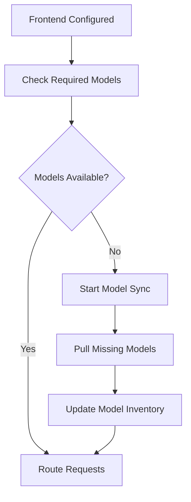

## Frontends

A **Frontend** is a virtual Ollama or OpenAI compatible endpoint that clients connect to. Frontends define how requests are routed and which backends serve those requests.

### Frontend Properties

| Property                    | Description                                               | Default             |
| --------------------------- | --------------------------------------------------------- | ------------------- |
| `Identifier`                | Unique identifier for the frontend                        | Required            |
| `Name`                      | Human-readable name                                       | Required            |
| `Hostname`                  | Hostname pattern (`*` for catch-all)                      | `*`                 |
| `TimeoutMs`                 | Request timeout in milliseconds                           | `60000`             |
| `LoadBalancing`             | Load balancing algorithm                                  | `RoundRobin`        |
| `Backends`                  | List of backend identifiers to use                        | `[]`                |
| `RequiredModels`            | Models that must be available (only for Ollama instances) | `[]`                |
| `MaxRequestBodySize`        | Maximum request size in bytes                             | `536870912` (512MB) |
| `UseStickySessions`         | Enable session stickiness                                 | `false`             |
| `StickySessionExpirationMs` | Session timeout in milliseconds                           | `1800000` (30 min)  |

### Load Balancing Algorithms

**Round Robin** (`RoundRobin`)

* Cycles through backends sequentially
* Ensures even distribution of requests
* Best for uniform backend capacity

**Random** (`Random`)

* Randomly selects from healthy backends
* Good for stateless workloads
* Provides natural load distribution

### Session Stickiness

**Session Stickiness** ensures that clients are consistently routed to the same backend for subsequent requests, which is useful for:

* **Stateful Applications**: When backends maintain client-specific state
* **Model Warm-up**: Keeping frequently accessed models loaded on specific backends
* **Performance Optimization**: Reducing model switching overhead

**How It Works:**

1. **Client Identification**: Uses the following values, in this order, to identify a client:
   1. A header value for any present HTTP header found in `Settings.StickyHeaders`; the default headers are `x-conversation-id` and `x-thread-id`
   2. Client IP address
2. **Backend Binding**: First request creates a session binding client to a specific backend
3. **Session Persistence**: Subsequent requests from the same client route to the bound backend
4. **Automatic Expiration**: Sessions expire after the configured timeout period
5. **Health Awareness**: Sessions are invalidated if the bound backend becomes unhealthy

**Configuration:**

* `UseStickySessions`: Enable/disable session stickiness (default: `false`)
* `StickySessionExpirationMs`: Session timeout in milliseconds (default: 30 minutes)
* **Minimum**: 10,000ms (10 seconds)
* **Maximum**: 86,400,000ms (24 hours)

**Session Management:**

* Sessions are automatically cleaned up every 5 minutes
* Expired sessions are removed from memory
* Backend failures invalidate all associated sessions
* Sessions are not persisted across OllamaFlow restarts

### Frontend Configuration Example

```json
{
  "Identifier": "production-frontend",
  "Name": "Production AI Inference",
  "Hostname": "ai.company.com",
  "LoadBalancing": "RoundRobin",
  "TimeoutMs": 90000,
  "Backends": ["gpu-1", "gpu-2", "gpu-3"],
  "RequiredModels": ["llama3:8b", "mistral:7b", "codellama"],
  "MaxRequestBodySize": 1073741824,
  "UseStickySessions": true,
  "StickySessionExpirationMs": 3600000
}
```

## Backends

A **Backend** represents a physical Ollama instance in your infrastructure. Backends handle the actual AI inference requests.

### Backend Properties

| Property                     | Description                                     | Default  |
| ---------------------------- | ----------------------------------------------- | -------- |
| `Identifier`                 | Unique identifier for the backend               | Required |
| `Name`                       | Human-readable name                             | Required |
| `Hostname`                   | Ollama server hostname/IP                       | Required |
| `Port`                       | Ollama server port                              | `11434`  |
| `Ssl`                        | Enable HTTPS for backend communication          | `false`  |
| `HealthCheckUrl`             | URL path for health checks                      | `/`      |
| `HealthCheckMethod`          | HTTP method for health checks                   | `GET`    |
| `UnhealthyThreshold`         | Failed checks before marking unhealthy          | `2`      |
| `HealthyThreshold`           | Successful checks before marking healthy        | `2`      |
| `MaxParallelRequests`        | Maximum concurrent requests                     | `4`      |
| `RateLimitRequestsThreshold` | Rate limiting threshold                         | `10`     |
| `ApiFormat`                  | Backend API format, either `Ollama` or `OpenAI` | `Ollama` |

### Health Monitoring

OllamaFlow continuously monitors backend health:

* **Health Checks**: Periodic HTTP requests to validate backend availability
* **Automatic Failover**: Unhealthy backends are removed from load balancing rotation
* **Recovery Detection**: Backends are automatically restored when they become healthy

### Backend States

* **Healthy**: Backend is responding to health checks and available for requests
* **Unhealthy**: Backend has failed health checks and is excluded from rotation
* **Unknown**: Initial state before first health check completion

### Backend Configuration Example

```json
{
  "Identifier": "gpu-server-1",
  "Name": "Primary GPU Server",
  "Hostname": "192.168.1.100",
  "Port": 11434,
  "Ssl": false,
  "HealthCheckUrl": "/api/version",
  "HealthCheckMethod": "GET",
  "UnhealthyThreshold": 3,
  "HealthyThreshold": 2,
  "MaxParallelRequests": 8,
  "RateLimitRequestsThreshold": 20,
  "ApiFormat": "Ollama"
}
```

## Models

OllamaFlow provides intelligent model management across your backend Ollama fleet.  This set of capabilities is not available for OpenAI-compatible backend instances.

### Model Discovery

* **Automatic Detection**: OllamaFlow periodically discovers available models on each backend
* **Real-time Updates**: Model availability is continuously tracked
* **Cross-Backend Visibility**: View which models are available on which backends

### Model Synchronization

When a frontend specifies `RequiredModels`, OllamaFlow automatically:

1. **Checks Availability**: Verifies if required models exist on associated backends
2. **Downloads Missing Models**: Pulls models to backends that don't have them
3. **Parallel Operations**: Downloads models concurrently for faster provisioning
4. **Status Tracking**: Monitors sync progress and completion

### Model Management Flow



### Model Requirements Example

```json
{
  "RequiredModels": [
    "llama3:8b",
    "mistral:7b",
    "codellama:13b",
    "nomic-embed-text"
  ]
}
```

## Request Flow

Understanding how requests flow through OllamaFlow:

1. **Client Request**: Client sends request to OllamaFlow frontend
2. **Frontend Matching**: OllamaFlow matches request hostname to frontend
3. **Backend Selection**: Load balancing algorithm selects healthy backend
4. **Model Verification**: Ensures required model is available on selected backend
5. **Request Proxy**: Request is forwarded to selected backend
6. **Response Streaming**: Response is streamed back to client

## Configuration Persistence

All frontend and backend configurations are stored in a SQLite database (`ollamaflow.db`), ensuring:

* **Persistence**: Configurations survive restarts
* **Atomic Updates**: Configuration changes are transactional
* **Historical Tracking**: Creation and update timestamps are maintained
* **Backup-Friendly**: Single file database for easy backup/restore

## Next Steps

* Learn about [Deployment Options](deployment-options.md) for your environment
* Review [Configuration Examples](configuration-examples.md) for common scenarios
* Explore the [API Reference](api-reference.md) for programmatic management
